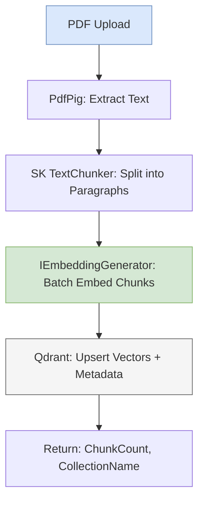
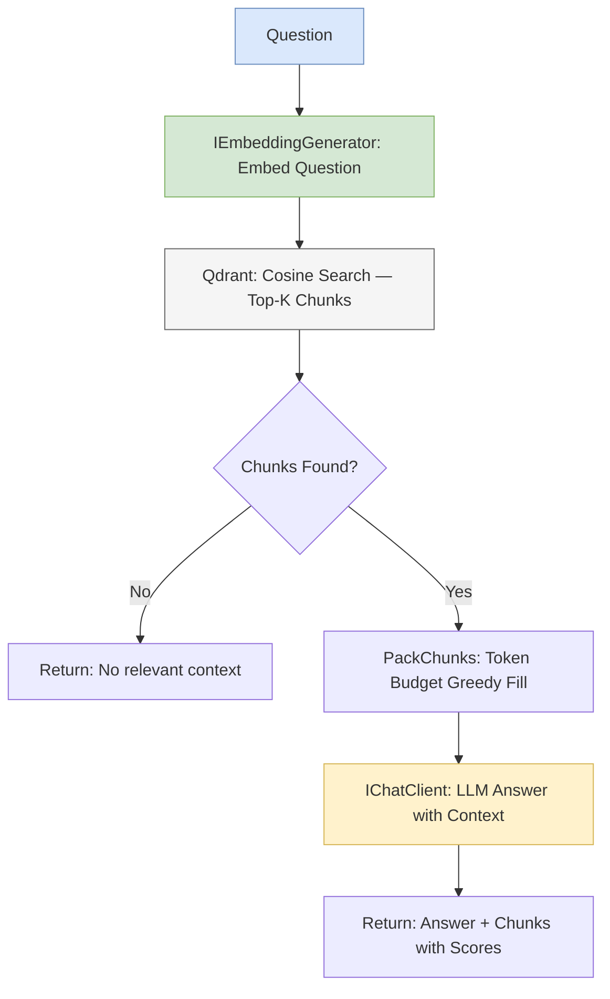
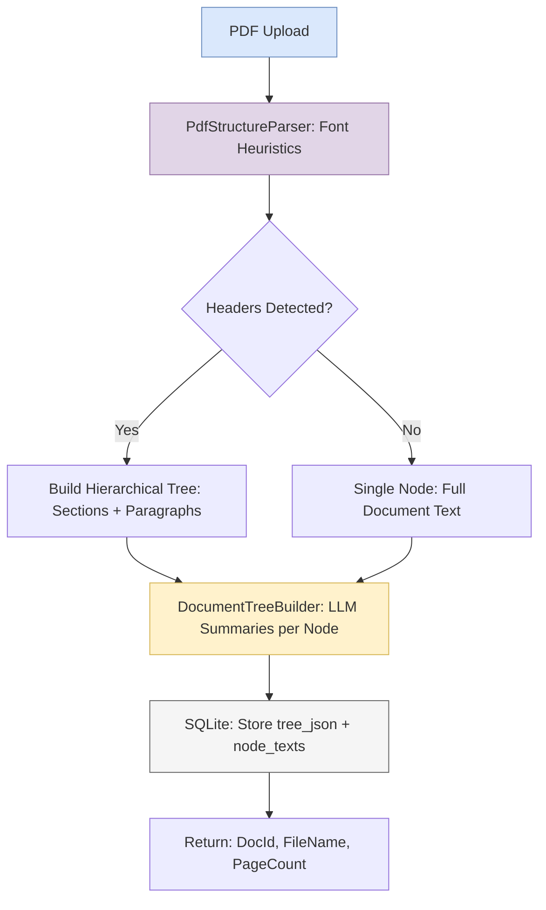
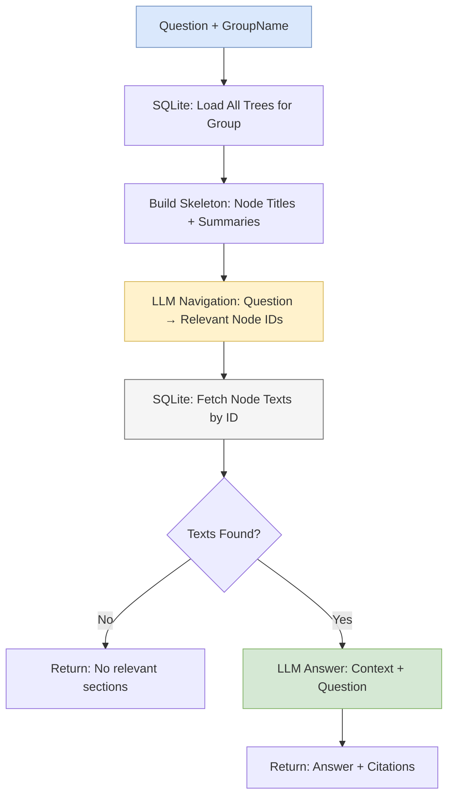
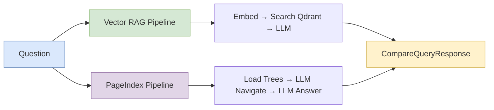

# Vector RAG vs Page Index RAG

[](https://github.com/saddam/VectorRAGvsPageIndexRAG/actions/workflows/ci.yml)

ASP.NET Core 10 Web API comparing Vector RAG and Page Index RAG strategies.

## How Each Approach Works

### Vector RAG

PDF text is chunked, embedded into vectors, and stored in Qdrant. Queries embed the question, find similar chunks via cosine search, and send them as context to an LLM.

### Page Index RAG (Vectorless)

PDF structure is parsed deterministically using font heuristics (no LLM for layout). An LLM generates summaries for each node. The hierarchical tree is stored in SQLite. Queries use the LLM to navigate the tree skeleton, fetch relevant node texts, and answer.

## Architecture Flow Diagrams

### Vector RAG — Ingestion Flow



### Vector RAG — Query Flow



### Page Index RAG — Ingestion Flow



### Page Index RAG — Query Flow



### Compare Endpoint — Side-by-Side



## Endpoints

| Method | Path | Description |
|--------|------|-------------|
| `POST` | `/api/rag/documents` | Vector: ingest PDF, chunk, embed, store in Qdrant |
| `GET` | `/api/rag/query` | Vector: embed question, search, LLM answer |
| `POST` | `/api/pageindex/documents` | PageIndex: deterministic parse + LLM summaries, store in SQLite |
| `GET` | `/api/pageindex/query` | PageIndex: LLM navigates tree, fetches sections, answers |
| `GET` | `/api/compare/query` | Compare both strategies side-by-side |

## Quick Start

```bash
# Start Qdrant
docker run -p 6333:6333 -p 6334:6334 qdrant/qdrant

# Set API keys via user secrets
dotnet user-secrets set "ProviderRegistry:OpenCode:ApiKey" "sk-..."
dotnet user-secrets set "EmbeddingRegistry:NvidiaNim:ApiKey" "nvapi-..."

# Run
dotnet run
```

Open Swagger UI at `https://localhost:51095/swagger`.

## Test PDFs

| File | Pages | Content |
|------|-------|---------|
| `test-pdfs/technical-report.pdf` | 10 | CloudSync API docs (sections, tables, code samples) |
| `test-pdfs/resume.pdf` | 5 | Dr. Sarah Chen ML engineer CV (skills, experience) |
| `test-pdfs/legal-contract.pdf` | 9 | Enterprise software license (clauses, GDPR, termination) |

Regenerate with: `dotnet run --project Tools/PdfGenerator/VectorRAGvsPageIndexRAG.Tools.PdfGenerator.csproj`

## Curl Examples

**RAG Ingest:**
```bash
curl -X 'POST' \
  'https://localhost:51095/api/rag/documents?collectionName=PDFs' \
  -H 'accept: text/plain' \
  -H 'Content-Type: multipart/form-data' \
  -F 'file=@test-pdfs/technical-report.pdf;type=application/pdf'
```

**PageIndex Ingest:**
```bash
curl -X 'POST' \
  'https://localhost:51095/api/pageindex/documents?provider=OpenCode&model=deepseek-v4-flash-free&groupName=PDFs' \
  -H 'accept: text/plain' \
  -H 'Content-Type: multipart/form-data' \
  -F 'file=@test-pdfs/technical-report.pdf;type=application/pdf'
```

**Compare Query:**
```bash
curl -X 'GET' \
  'https://localhost:51095/api/compare/query?question=What%20is%20the%20CloudSync%20API%20rate%20limit%3F&provider=OpenCode&model=deepseek-v4-flash-free&groupName=PDFs&collectionName=PDFs' \
  -H 'accept: text/plain'
```

## Results

Run against `test-pdfs/` using OpenCode / `deepseek-v4-flash-free`:

| Question | Vector RAG (ms) | PageIndex RAG (ms) | Vector Answer | PageIndex Answer |
|----------|----------------:|--------------------:|---------------|------------------|
| What is the CloudSync API rate limit? | 25,556 | 25,556 | Free: 100/min, Pro: 1,000/min, Enterprise: 10,000/min, Premium: 50,000/min | 1000 requests per minute per client ID |
| What programming languages does the candidate know? | 11,881 | 11,881 | Python, Java, C++, R, SQL, JavaScript, Go | Context does not contain information about programming languages |
| What are the termination clauses? | 77,069 | 77,069 | Section 5.1: Agreement continues for Subscription Term. Section 5.2: Either party may terminate for cause upon 30 days notice | Section 5.1: Agreement commences on Effective Date. Section 5.2: Either party may terminate for material breach |
| Compare performance metrics across sections | 110,473 | 110,473 | ML Engineer: 95% accuracy, 40% latency reduction. Data Scientist: 89% AUC churn model | Rate Limiting: 100-50,000 req/min by tier. Throughput: 10M+ daily users. Latency: 40% reduction via TensorRT |
| What is the meaning of life? | 7,977 | 7,977 | No information about the meaning of life in context | No relevant sections found |

### Key Observations

| Aspect | Vector RAG | Page Index RAG |
|--------|------------|----------------|
| **Ingestion speed** | Fast (~1-2s per PDF) | Slow (~90-215s per PDF, LLM per node) |
| **Query latency** | 8-110s (embed + search + LLM) | 8-110s (2 LLM calls: navigate + answer) |
| **Factual accuracy** | Good — retrieves exact chunks | Good — navigates to correct sections |
| **Multi-document queries** | Struggles (chunks from all docs mixed) | Better (tree structure preserved per doc) |
| **Out-of-scope handling** | Gracefully says "no info" | Gracefully says "no relevant sections" |
| **Infrastructure** | Requires Qdrant + embedding API | SQLite only (zero external infra) |
| **Embedding dependency** | Yes (NvidiaNim/external API) | No embeddings needed |

## Configuration

| Section | Purpose |
|---------|---------|
| `ProviderRegistry` | Chat LLM providers (OpenCode, OpenRouter, NvidiaNim, GoogleAI, etc.) |
| `EmbeddingRegistry` | Embedding models (NvidiaNim, Ollama), `ActiveEmbeddingProvider` selects active |
| `VectorStoreRegistry` | Vector DB (Qdrant), `ActiveProvider` selects active |
| `PageIndex` | SQLite path (`DbPath: "pageindex.db"`) |
| `ProviderContextWindows` | Context window sizes per provider/model for token budgeting |

## Design Decisions

- **Deterministic PDF parsing**: Font size heuristics (>=1.2x median = header), vertical gaps (>=1.5x line height = paragraph). LLM only generates summaries.
- **SQLite over a second vector DB**: PageIndex uses SQLite — zero external infra. Tree navigation via LLM reasoning, not similarity search.
- **No IVectorStore abstraction (YAGNI)**: Qdrant.Client directly until a second provider is needed.
- **gRPC port 6334**: Qdrant gRPC is on 6334, not 6333 (HTTP REST).
- **Vector size derived from embedding output**: No config duplication — embedding model determines vector size at runtime.
- **Token budgeting**: `PackChunks()` uses greedy fill with char-count estimation (`text.Length / 4`) to fit context into model window.
