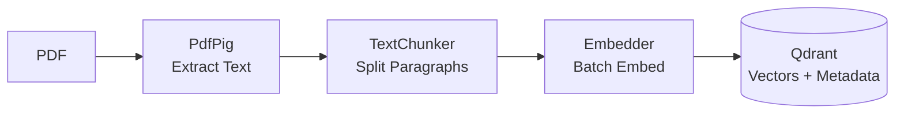
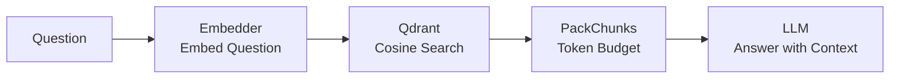
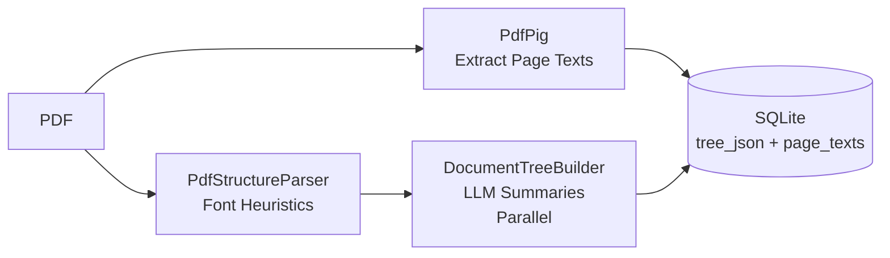
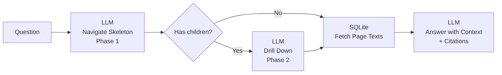
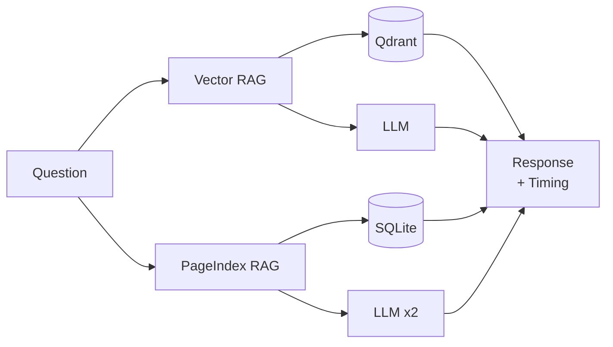

# Vector RAG vs Page Index RAG

[](https://github.com/saddam/RAGBench/actions/workflows/ci.yml)

ASP.NET Core 10 Web API comparing Vector RAG and Page Index RAG strategies.

## How Each Approach Works

### Vector RAG

PDF text is chunked, embedded into vectors, and stored in Qdrant. Queries embed the question, find similar chunks via cosine search, and send them as context to an LLM.

### Page Index RAG (Vectorless)

PDF structure is parsed deterministically using font heuristics (no LLM for layout). An LLM generates summaries for each node. The hierarchical tree is stored in SQLite with page numbers per node. Queries use two-phase retrieval: Phase 1 picks top-level sections from a truncated skeleton, Phase 2 drills into sub-sections. Page text is stored at ingest time, not per-node.

## Flow Diagrams

### Vector RAG Ingestion



### Vector RAG Query



### Page Index Ingestion



### Page Index Query



### Compare Endpoint



## Endpoints

| Method | Path | Query Params | Description |
|--------|------|--------------|-------------|
| `POST` | `/api/rag/documents` | `collectionName` (default: `PDFs`) | Ingest PDF: extract text, chunk, embed, store in Qdrant |
| `GET` | `/api/rag/query` | `question`, `provider`, `model`, `topK` (default: 2), `collectionName` (default: `PDFs`) | Embed question, cosine search, LLM answer |
| `POST` | `/api/pageindex/documents` | `provider`, `model`, `groupName` (default: `PDFs`) | Deterministic PDF parse + LLM summaries, store in SQLite |
| `GET` | `/api/pageindex/query` | `question`, `provider`, `model`, `groupName` | LLM navigates tree skeleton, fetches sections, answers |
| `GET` | `/api/compare/query` | `question`, `provider`, `model`, `topK` (default: 2), `groupName`, `collectionName` | Run both RAG strategies side-by-side with timing |
| `POST` | `/api/chat` | `question`, `provider` (default: `OpenRouter`), `model` (default: `openrouter/free`) | Direct LLM chat (no RAG pipeline) |

## Quick Start

```bash
# Start Qdrant
docker run -p 6333:6333 -p 6334:6334 qdrant/qdrant

# Set API keys via user secrets
dotnet user-secrets set "ProviderRegistry:OpenCode:ApiKey" "sk-..."
dotnet user-secrets set "EmbeddingRegistry:NvidiaNim:ApiKey" "nvapi-..."

# Run
dotnet run
```

Open Swagger UI at `https://localhost:51095/swagger`.

## Test PDFs

| File | Pages | Content |
|------|-------|---------|
| `test-pdfs/technical-report.pdf` | 10 | CloudSync API docs (sections, tables, code samples) |
| `test-pdfs/resume.pdf` | 5 | Dr. Sarah Chen ML engineer CV (skills, experience) |
| `test-pdfs/legal-contract.pdf` | 9 | Enterprise software license (clauses, GDPR, termination) |

Regenerate with: `dotnet run --project Tools/PdfGenerator/RAGBench.Tools.PdfGenerator.csproj`

## Curl Examples

**RAG Ingest:**
```bash
curl -X 'POST' \
  'https://localhost:51095/api/rag/documents?collectionName=PDFs' \
  -H 'accept: text/plain' \
  -H 'Content-Type: multipart/form-data' \
  -F 'file=@test-pdfs/technical-report.pdf;type=application/pdf'
```

**PageIndex Ingest:**
```bash
curl -X 'POST' \
  'https://localhost:51095/api/pageindex/documents?provider=OpenCode&model=deepseek-v4-flash-free&groupName=PDFs' \
  -H 'accept: text/plain' \
  -H 'Content-Type: multipart/form-data' \
  -F 'file=@test-pdfs/technical-report.pdf;type=application/pdf'
```

**Compare Query:**
```bash
curl -X 'GET' \
  'https://localhost:51095/api/compare/query?question=What%20is%20the%20CloudSync%20API%20rate%20limit%3F&provider=OpenCode&model=deepseek-v4-flash-free&groupName=PDFs&collectionName=PDFs' \
  -H 'accept: text/plain'
```

## Results

Run against `test-pdfs/` using OpenCode / `deepseek-v4-flash-free`:

| Question | Vector RAG (ms) | PageIndex (ms) | Vector Answer | PageIndex Answer |
|----------|----------------:|---------------:|---------------|------------------|
| What is the CloudSync API rate limit? | 6,310 | 229,745 | Free: 100/min, Pro: 1,000/min, Enterprise: 10,000/min, Premium: 50,000/min | Free: 100/min, Pro: 1,000/min, Enterprise: 10,000/min, Premium: 50,000/min + OAuth 1000/min per client ID |
| What programming languages does the candidate know? | 4,970 | 80,586 | Python, Java, C++, R, SQL, JavaScript, Go | Python, Java, C++, R, SQL, JavaScript, Go |
| What are the termination clauses in this contract? | 10,920 | 63,456 | Section 5.1: Agreement continues for Subscription Term. Section 5.2: Either party may terminate for cause upon 30 days notice | No termination clauses in context (token budget cut off before Section 5 page text retrieved) |
| Compare performance metrics across all sections | 38,020 | 400,000+ (timeout) | 95% accuracy, 40% latency reduction, 89% AUC churn model, 3.95 GPA | Timeout (too many Phase 2 LLM calls for broad query) |
| What is the meaning of life? | 5,330 | 38,803 | No information about the meaning of life in context | No relevant sections found |

### Key Observations

| Aspect | Vector RAG | Page Index RAG |
|--------|------------|----------------|
| **Ingestion speed** | Fast (~1-2s per PDF) | Slow (~90-215s per PDF, LLM per node) |
| **Query latency** | 5-38s (embed + search + LLM) | 39-230s (3 LLM calls: navigate + drill-down + answer) |
| **Factual accuracy** | Good — retrieves exact chunks | Good — navigates to correct sections, but token budget may cut off context |
| **Citations** | Chunks with similarity scores | Page numbers (e.g. "pages 5-6") via two-phase retrieval |
| **Multi-document queries** | Struggles (chunks from all docs mixed) | Better (tree structure preserved per doc) |
| **Out-of-scope handling** | Gracefully says "no info" | Gracefully says "no relevant sections" |
| **Infrastructure** | Requires Qdrant + embedding API | SQLite only (zero external infra) |
| **Embedding dependency** | Yes (NvidiaNim/external API) | No embeddings needed |
| **Two-phase retrieval** | N/A | Phase 1 picks top-level, Phase 2 drills down (adds latency but improves precision for large docs) |

## Configuration

| Section | Purpose |
|---------|---------|
| `ProviderRegistry` | Chat LLM providers (OpenRouter, NvidiaNim, FoundryLocal, Ollama, OpenCode, GoogleAI) |
| `EmbeddingRegistry` | Embedding models (NvidiaNim, Ollama), `ActiveEmbeddingProvider` selects active |
| `VectorStoreRegistry` | Vector DB (Qdrant, AzureAISearch), `ActiveProvider` selects active |
| `PageIndex` | SQLite path (`DbPath`), `MaxSkeletonDepth` (default: 3), `MaxTokensPerQuery` (default: 20000) |
| `ProviderContextWindows` | Context window sizes per provider/model for token budgeting |

## Design Decisions

- **Deterministic PDF parsing**: Font size heuristics (>=1.2x median = header), vertical gaps (>=1.5x line height = paragraph). LLM only generates summaries.
- **SQLite over a second vector DB**: PageIndex uses SQLite — zero external infra. Tree navigation via LLM reasoning, not similarity search.
- **MEVD abstraction**: Uses `VectorStore` from Microsoft.Extensions.VectorData — swapping vector DBs means changing one DI registration, not rewriting services.
- **gRPC port 6334**: Qdrant gRPC is on 6334, not 6333 (HTTP REST).
- **Vector size derived from embedding output**: No config duplication — embedding model determines vector size at runtime.
- **Token budgeting**: `PackChunks()` uses greedy fill with char-count estimation (`text.Length / 4`) to fit context into model window.
- **PageIndex page numbers**: `StartPage`/`EndPage` on TreeNode enables citations ("pages 5-6") and page-based text retrieval.
- **Two-phase retrieval**: Phase 1 picks top-level sections from truncated skeleton, Phase 2 drills into sub-sections. Handles 1000+ page PDFs without context overflow.
- **Parallel summaries**: `Task.WhenAll` instead of sequential `foreach` — 10x faster ingestion.
